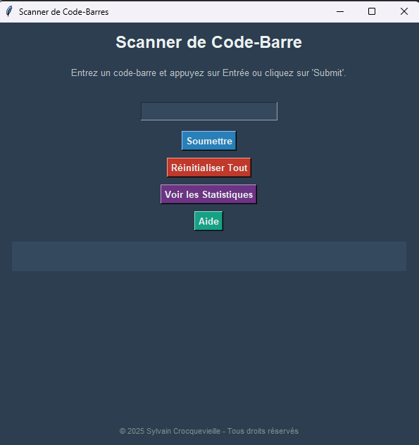
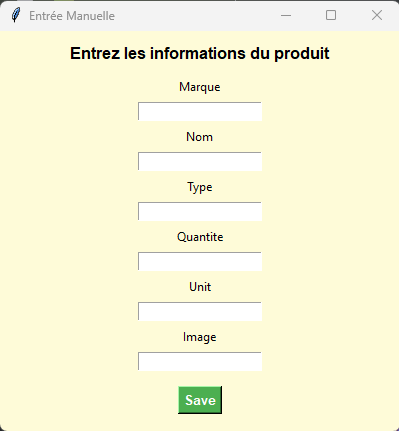

# Scanner de Code-Barres

## Description

Le **Scanner de Code-Barres** est une application interactive créee avec Python et Tkinter, permettant de gérer et d'interagir avec des codes-barres. L'application prend en charge plusieurs fonctionnalités, comme l'ajout, la modification, la suppression, et la gestion des informations des produits scannés. Elle inclut également la possibilité d'afficher des statistiques complètes sur les produits.

Cette application utilise l'API d'**OpenFoodFacts** pour récupérer des informations sur les produits à partir d'un code-barres, et permet une gestion locale des données grâce à un fichier `output.json`.

---

## Fonctionnalités

- **Ajouter un produit** :
  - Scannez ou entrez un code-barres pour ajouter un produit.
  - Si le produit est introuvable sur OpenFoodFacts, une entrée manuelle est possible.

- **Modes intégrés** :
  - **Mode Retirer** : Supprime ou réduit la quantité d'un produit enregistré.
  - **Mode Modification** : Permet de modifier les informations d'un produit existant.
  - **Mode Copie** : Duplique les informations d'un produit existant sur un autre code-barres.
  - **Mode Réinitialiser** : Réinitialise les quantités de produits (individuellement ou globalement à 0).
  - **Afficher les Informations** : Affiche les détails d'un produit.

- **Statistiques détaillées** :
  - Nombre total de produits scannés.
  - Nombre moyen d'articles par produit unique.
  - Liste des 5 produits les plus scannés et leur contribution au total.
  - Produit le moins scanné.

- **Fichiers de données persistants** :
  - Les produits sont sauvegardés automatiquement dans le fichier `output.json`.

---

## Prérequis

Avant d'exécuter le projet, assurez-vous d'avoir installé les éléments suivants :

- Python **3.7+**
- (Optionnel) Scanneur de Code Barres
---

## Instructions d'exécution

1. Téléchargez ou clonez le projet depuis le dépôt.
2. Ouvrez un terminal dans le répertoire contenant le script.
3. Exécutez l'application avec la commande suivante :

```bash
python scanner.py
```

Si vous voulez utiliser une base de données:
1. Importez le projet dans pycharm
2. Changer la valeur BDD dans Params.py a True
3. Mettez vos identifiants
4. Puis faites ces commandes dans le powershell de pycharm

```bash
Remove-Item -Recurse -Force .venv
python -m venv .venv
.venv\Scripts\activate
pip install --upgrade pip
pip install requests
pip install pillow
pip install mysql
pip install mysql-connector-python
pyinstaller --onefile --noconsole --add-data "bdd.py;." --add-data "Params.py;." scanner.py
python scanner.py
```
---

## Guide des commandes et raccourcis

### Modes disponibles

| Mode                     | Commande pour l'activer   | Description                                                                                     |
|--------------------------|---------------------------|-------------------------------------------------------------------------------------------------|
| **Mode Ajout (par défaut)** | `28061`                   | Ajoute un produit ou met à jour la quantité si le produit est déjà enregistré.                 |
| **Mode Retirer**           | `28062` ou touche `R`      | Retire un produit, réduit sa quantité ou le supprime si sa quantité atteint 0.                 |
| **Mode Modification**      | `28063` ou touche `M`      | Permet la modification manuelle des informations d'un produit.                                 |
| **Mode Copie**             | `28064` ou touche `C`      | Copie les informations d'un produit pour un nouveau code-barre.                                |
| **Mode Réinitialiser**     | `28065` ou touche `X`      | Réinitialise les quantités d'un produit ou de tous les produits à 0.                           |
| **Afficher Informations**  | `28066` ou touche `I`      | Affiche les informations détaillées pour un produit donné en fonction de son code-barres.      |

### Raccourcis supplémentaires
- **Réinitialiser tous les produits** : Appuyez sur `Fin`.
- **Effacer le champ d'entrée** : Appuyez sur `Suppr`.
- **Afficher les statistiques** : Appuyez sur `S`.
- **Accéder à l'aide intégrée** : Appuyez sur `H`.

---

## Exemple d'interface utilisateur

L'application utilise **Tkinter** pour son interface graphique et offre une interface intuitive avec des boutons pour soumettre, réinitialiser, accéder aux statistiques, ainsi que des notifications en temps réel.




---

## Utilisation d'OpenFoodFacts

Cette application utilise l'API d'OpenFoodFacts pour récupérer automatiquement les informations associées à un code-barres scanné.

### Requête API
Chaque requête pour un produit est envoyée sous la forme :
GET [https://world.openfoodfacts.org/api/v2/product/](https://world.openfoodfacts.org/api/v2/product/)<code-barres>.json

Si l'API retourne une erreur ou si le produit est manquant, une entrée manuelle est proposée.

---

## Exportation à des fichiers exécutables

### Pour Windows :
Pour créer un fichier `.exe` exécutable pour Windows, utilisez la commande suivante avec **PyInstaller** :

```bash
pyinstaller --onefile --noconsole --add-data "bdd.py;." --add-data "Params.py;." scanner.py
```

### Pour Linux :
Pour créer un fichier exécutable Linux, utilisez cette commande sous Linux :

```bash
pyinstaller --onefile --noconsole --add-data "bdd.py;." --add-data "Params.py;." scanner.py
```

Le fichier exécutable généré sera situé dans le dossier `/dist`.

---

## Auteur

- **Nom** : Sylvain Crocquevieille (NiavlySDev)
- **Année** : 2025

---

## Licence

Ce projet est sous licence **propriétaire**. Tous droits réservés.